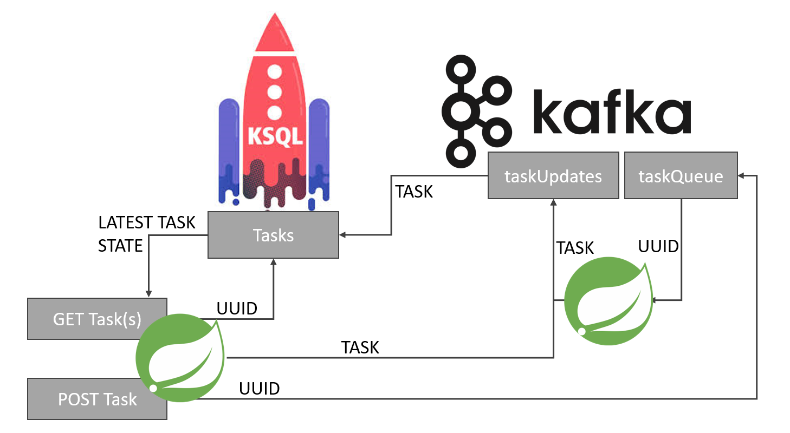

# Quick start

Simple REST API composed of Java Spring microservices, 
using KsqlDB and Kafka to process async requests.

## Usage

1. Build instructions:

```bash
./gradlew build && docker compose build && docker compose up -d
```
Build process involve downloading and starting a cluster so it might take a few minutes to start.
\
Please read: [Monitoring](#Monitoring) to make sure that all required services are up
\
(TaskApi Service, Processor Service, KsqlDB, Kafka Broker and Zookeeper) 
\
For more details read [OpenAPI](#OpenAPI) documentation

2. Schedule task:
```bash
curl -X POST \
-H "Content-Type: application/json" \
-d '{"pattern": "TDD", "input": "ABCDEFG"}' \
http://localhost:8080/api/v1/tasks
```


3. Get task:
```bash
curl http://localhost:8080/api/v1/tasks/{UUID}

#example:
curl http://localhost:8080/api/v1/tasks/fd817eac-7c2e-4deb-839f-6f76e21147e0
```
4. Get all tasks:
```bash
curl http://localhost:8080/api/v1/tasks
```

5. Stop all containers using:

```bash
docker compose down
```

### Monitoring

```bash
 docker exec -i asynctaskprocessor-ksqldb-cli-1 ksql http://ksqldb-server:8088
 SELECT * FROM updates EMIT CHANGES;
```

```bash
 docker exec -i asynctaskprocessor-ksqldb-cli-1 ksql http://ksqldb-server:8088
 SELECT * FROM taskqueue EMIT CHANGES;
```

```bash
 docker-compose logs -f taskapi
 docker-compose logs -f processor
```


### Application configuration
For demo purposes topics are configured to 10 partitions
\
concurrency param can be used to scale number of listeners per processor service
```yaml
spring:
  kafka:
    listener:
      concurrency: 3
```

#### OpenAPI

OpenAPI documentation is accessible via:
`http://localhost:8080/swagger-ui/index.html`.

## License

[MIT](https://choosealicense.com/licenses/mit/)
